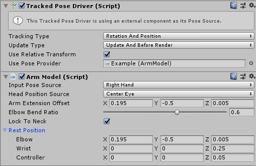
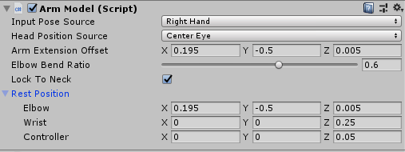
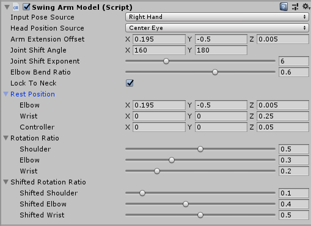
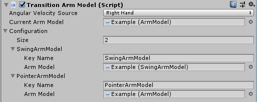
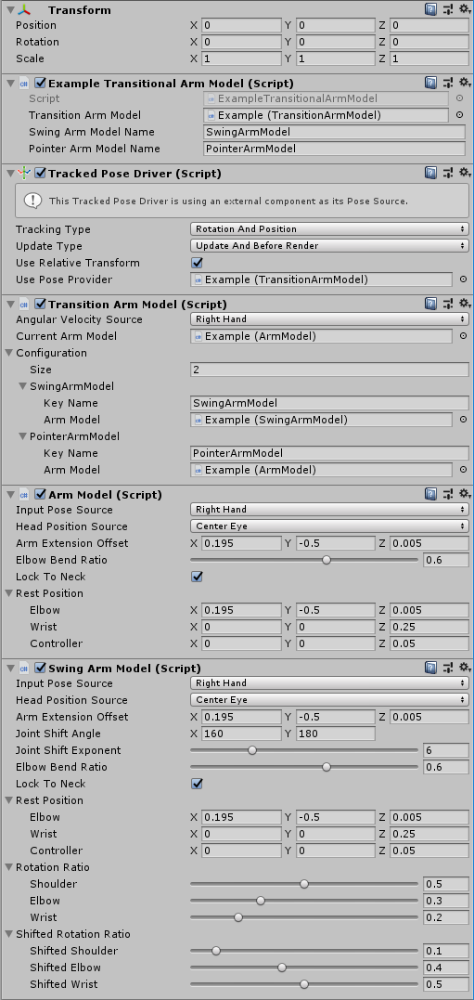

# Arm Models

The Legacy Input Helpers (com.unity.xr.legacyinputhelpers) package contains three arm model components. These are:

- [Arm Model](#Base-Arm-Model)
- [Swing Arm Model](#Swing-Arm-Model)
- [Transition Arm Model](#Transition-Arm-Model)

These arm models correspond to the arm models in the Google Daydream package. View the original code on the Google VR documentation page [Quickstart for Google VR SDK for Unity with Android](https://developers.google.com/vr/develop/unity/get-started-android).

# Using the Arm Models

The Arm Model, Swing Arm Model and Transition Arm Model are “pose providers”, which you can connect to the Tracked Pose Driver component via the Use Pose Provider field.

Pose providers allow Unity to perform custom logic while still retaining the update and transform utility of the Tracked Pose Driver. For the arm models, Unity reads rotation and acceleration data from the controller pose node, and the Head position from the Head node, then calculates a position in session space based on a mathematical arm model.

The following image demonstrates how to use the Arm Model with a Tracked Pose Driver:



In the image above, the Arm Model component is set as the Use Pose Provider field of the Tracked Pose Driver. This means the Tracked Pose Driver is using the Arm Model component to determine its pose.

The following section outlines the parameters that are found on the inspector of the arm model.

## Base Arm Model

You can use the base Arm Model component for most situations that require pointing or throwing. This section outlines the parameters in the Inspector of the Arm Model, and how to configure them.



| Property | Description |
|---|---|
| Input Pose Source | Define which XR Node to use as the controller tracking input source. The arm model uses pose data and gyro/angular acceleration data for this XR Node to drive its calculations. This is set to __Left Hand__ by default. |
| Head Position Source | Define which XR Node to use to drive the Head Position when calculating the arm model. This is set to __Center Eye__ by default. |
| Arm Extension Offset | Define how much offset to apply to the elbow position as the controller rotates upwards. By default, this is set up to simulate realistic arm movement: __X__ is set to 0.195, __Y__ is set to -0.5, and __Z__ is set to 0.005. |
| Elbow Bend Ratio | Define the ratio of the controller’s rotation to apply to the rotation of the elbow. The Arm Model applies the remaining rotation to the wrist's rotation. By default, this is set to 0.6 to simulate realistic arm movement. |
| Lock To Neck | Enable this checkbox to use the Head Position Source to determine the model's neck position. If you disable it, Unity assumes that the neck position is Vector3's zero. This is enabled by default. |
| Rest Position | Specify the joint positions of each part of the mathematical model of the arm relative to the head position, before Unity applies the arm model. <br>The positions defined here are multiplied by -1 for the left arm, or 1 for the right arm. The positions are therefore relative to the center of the head. <br>- **Elbow**: The position of the elbow joint relative to the head before the Tracked Pose Driver applies the arm model pose. By default, __X__ is set to 0.195, __Y__ is set to -0.5, and __Z__ is set to 0.005.  <br>- **Wrist**: The position of the wrist joint relative to the head before the Tracked Pose Driver applies the Arm Model pose. By default, __X__ is set to 0, __Y__ is set to 0, and __Z__ is set to 0.25.<br>- **Controller**: The position of the controller joint relative to the head before the Tracked Pose Driver applies the arm model pose. By default, __X__ is set to 0, __Y__ is set to 0, and __Z__ is set to 0.05. |

## Swing Arm Model

The Swing Arm Model component has the same base settings as the [Arm Model](#Base-Arm-Model) but also contains some additional extra parameters to define swinging motion.

The Swing Arm Model is intended to be used as a pose provider to a tracked pose driver in the same way as the base arm model.  It has a set of Rotation Ratio parameters, which the Tracked Pose Driver applies when the controller is pointing in the opposite direction to the camera.

The image below shows the Swing Arm Model component.



See documentation on the [Arm Model component](#Base-Arm-Model) for information on the base settings. The table below only includes the settings that are specific to the Swing Arm Model component.

| Property | Description |
| ------------ | ----------- |
| Joint Shift Angle | The joint shift angle property specifies the minimum (__X__) and maximum (__Y__) angle at which the model lerps from using the normal rotation ratio for the joint to the shifted rotation ratio. Below the minimum value, Unity uses the normal rotation ratio; above the maximum value, Unity uses the shifted rotation ratio. You should use the shifted rotation ratio when the controller is facing towards the user (or the opposite direction to its normal orientation).|
| Joint Shift Exponent | The mathematical exponent that Unity applies to the blend between the rotation ratio, and the shifted rotation ratio.|
| Rotation Ratio | Use this section to configure how much of the controller rotation to apply to different joints in the simulation. <br>- **Shoulder:** The portion of the controller rotation the Tracked Pose Driver applies to the shoulder joint.  <br>- **Elbow:** The portion of the controller rotation the Tracked Pose Driver applies to the elbow joint. <br>- **Wrist:** The portion of the controller rotation the Tracked Pose Driver applies to the wrist joint.|
| Shifted Rotation Ratio | Use this section to configure how much of the controller rotation to apply to different joints in the simulation when the controller is pointing away from the user (or in the opposite direction to its normal orientation).<br>- **Shifted Shoulder:** The portion of the controller rotation the Tracked Pose Driver applies to the shoulder joint when the controller is backwards.<br>- **Shifted Elbow:** The portion of the controller rotation the Tracked Pose Driver applies to the elbow joint when the controller is backwards.<br>- **Shifted Wrist:** The portion of the controller rotation the Tracked Pose Driver applies to the wrist joint when the controller is backwards.|


# Transition Arm Model

Use the Transition Arm Model for transitions between arm models at run time. Like the base Arm Model and the Swing Arm Model, apply it to the Tracked Pose Driver’s __Use Pose Provider__ field to implement it.

When the arm model changes at run time, Unity uses the angular acceleration of the Angular Velocity Source to control the blend rate of the transition to the new arm model.

The image below shows the Transition Arm Model component.



## Current Arm Model Component

Use this field to define which arm model the Tracked Pose Driver currently uses as the active arm model. Usually, you should set this to the arm model you want the component to use at run time. During run time, this changes when the component transitions from one arm model to another. Setting the current arm model field when in play mode will directly set the current arm model being applied, but will not override any arm model transitioning that is currently occurring.

## Transitions

The Transitions field is a list of key/arm model pairs. The Queue function allows Unity to pass an arm model, or a string. If the string matches any of the transitions in the Transitions list, Unity begins to transition that arm model in.

### Key

A string key, which Unity uses to identify the arm model it should transition to.

### Arm Model

The arm model that Unity transitions to if the transition arm model is in the queue with the matching string Key value.

## Using the Transition Arm Model

Use the Transition Arm Model component to transition between two or more arm models. When the application triggers a transition, the component transitions the arm model from the one listed in its __Current Arm Model__ property to one set in the `Queue` method.

The Transition Arm Model then transitions from the __Current Arm Model__ to the arm model that the application has queued.

The transitioning between arm models is driven by the angular velocity of the transition pose source XR node. The more angular velocity expressed by this controller, the faster the transition arm model will transition towards to the queued arm model.

Example:
- The application starts with the __Current Arm Model__ field referencing a simple pointing arm model.
- The user interacts with a ball, and the application scripts requests that the Transition Arm Model queue a swing arm model to allow the user to throw the ball.
- The user then throws the ball and, as the ball is released, the application scripts request that the transitional arm model queue the original starting pointing arm model.

The following image shows the configuration of the Transition Arm Model for this scenario.




On this example GameObject, the Tracked Pose Driver component is dependent on the Transition Arm Model component. It applies the Transition Arm Model’s __Current Arm Model__ at start up. Here, it refers to the same base ArmModel as the one configured in the Transitions.

The Transitions section has two elements configured: the Swing Arm Model for swinging behaviors, and the pointing arm model for pointing.

The following example MonoBehaviour has a reference to the Transition Arm Model that it controls, and the names of the arm models that it can transition between.

The code below shows the implementation of the example Transition Arm Model MonoBehaviour:

```csharp
public class ExampleTransitionArmModel : MonoBehaviour
{
    [SerializeField]
    public UnityEngine.XR.LegacyInputHelpers.TransitionArmModel transitionArmModel;

    [SerializeField]
    public string swingArmModelName = "SwingArmModel";

    [SerializeField]
    public string pointerArmModelName = "PointerArmModel";

    float timeToNextButtonPress = 0.0f;
    int currentArmModel = 0;

    // Update is called once per frame
    void Update()
    {
        // This uses the Right Trigger on the controller. To seed the input Asset with this action,
        // see the XR Input Seeding documentation
        if (timeToNextButtonPress <= 0.0f && Input.GetButton("XRI_Right_TriggerButton"))
        {
            if(currentArmModel == 0)
            {
                transitionArmModel.Queue(swingArmModelName);
            }
            else
            {
                transitionArmModel.Queue(pointerArmModelName);
            }
            // Flip which arm to use
            currentArmModel = currentArmModel == 0 ? 1 : 0;
            timeToNextButtonPress = 1.0f; // wait a second before allowing another arm model to be queued
        }
        else
        {
            timeToNextButtonPress -= Time.deltaTime;
        }
    }
}

```
